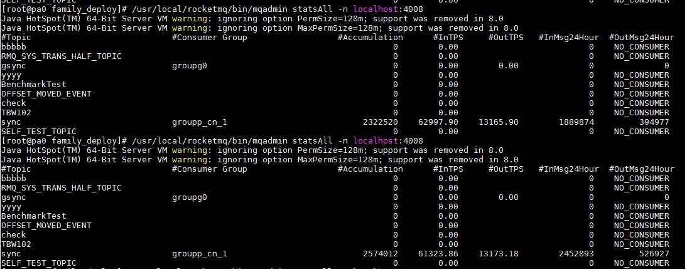

# 1.begin profile

* TPS: 2k-3k

* 发现所有操作都在 redis_bus::processm => hash操作都定位在同一key中了

[nredis91](./imgs/perf2/nredis91_exphash.pdf)

# 2.nredis92

* append key in redis_bus if is hash operator

* set redisbus_parall=16

* TPS: >7k

[nredis92](./imgs/perf2/nredis92_exphash.pdf)

# 3.nredis93

* 将redis command 枚举化

* 日志切割太快, 不好定位. => 将大小从64M改成2G.

* set redis_bus_parall=128

* TPS: >20k

[nredis93](./imgs/perf2/nredis93_exphash.pdf)

* 此次问题:
    * redis_bus_node::gener::finish()是瓶颈: 耗901.64s

    * callvct::upvct亦耗时: 314.64s

    * sendmsg_and_commitvct耗时: 198.29s

# 4.redis_bus_gener优化

* finish()中不reset tmpmap

* append时初始数组大小为1

[nredis94](./imgs/perf2/nredis94_exphash.pdf)

# 5.use redis_caller like nyrep

* cache, one thread one caller by parall

* TPS: >30k

[nredis95](./imgs/perf2/nredis95_exphash.pdf)

# 6.decrease log

* (apn.h, exphash, print_vct)

* msg no DebugString

* up ymsg.servers connection count to 100. (6exphash=600 + nyrep400 => 1000)

[nredis96](./imgs/perf2/nredis96_exphash.pdf)

# 7.nredis97

* no process rc_none or rc_super_hdelex in apn.h

[nredis97](./imgs/perf2/nredis97_exphash.pdf)

# 8.nredis98

* change if to switch for redis_node::cmd_

* decrease log in redis_caller::exec

* TPS: > 4w

* 额外任务
    * fix----crash in fake client (vct must not going while server loading)

[nredis98](./imgs/perf2/nredis98_exphash.pdf)

# 9.nredis99

* performance str_equal_case:replace tolower to stricmp

* TPS: 37986.47

[nredis99](./imgs/perf2/nredis99_exphash.pdf)

* 此次问题
    * exp_thread::rocksdb::Seek 耗时 356.47s

# 10.nredis9a

* put expire keys to the header of rocksdb

* batch calling super_hdelex

[nredis9a](./imgs/perf2/nredis9a_exphash.pdf)

# 11.nredis9b

* batch call vct

[nredis9b](./imgs/perf2/nredis9b_exphash.pdf)

* 待全解之殇

    * 

# 12.nredis9c

* change [hashex_db] to [hashex_oper], only check the key prefix

* there are some sync bug with redis command: extractslow, vct return value is -3

* so make sure vct at the same node with its redis command

* TPS: > 5w

[nredis9c](./imgs/perf2/nredis9c_exphash.pdf)

* 此次发现批量vct操作 hit bug:

# 13.nredis9d

* vct no persistent to AOF

[nredis9d](./imgs/perf2/nredis9d_exphash.pdf)

# 14.nredis9e

* batch write to rocksdb

* batch send ymsgs

* TPS: > 6w

[nredis9e](./imgs/perf2/nredis9e_exphash.pdf)

