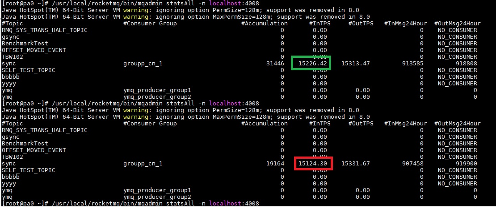

# 1.perf0(base&archtect)

## 1.1.step1(2k -> 6k)

* BLOCK\_SIZE
* export ymsg\_workcount=512
* export ymsg\_client\_size=400
* export pgbus\_parall=128

## 1.2.step2(log)

## 1.3.step3(7.5k)

* pass [begin]
* decrease [commit] count
* serialize to buf directly
* no serialize before append

## 1.4.step4(>10k)

* nyrep

# 2.perf(gperftoos::profile)

## 2.0.begin profile

[nyrep0](./imgs/perf/nyrep0_full.pdf)

## 2.1.cache connection in yrep\_redis\_caller

[nyrep1](./imgs/perf/nyrep1_full.pdf)

## 2.2.link to tcmalloc(10k -> 12k)

[nyrep2](./imgs/perf/nyrep2_full.pdf)

* TPS: > 12k

## 2.3.performance log(12k -> 15k)

[nyrep3](./imgs/perf/nyrep3_full.pdf)

* fprintf&LOG(ERROR)&/dev/null

* TPS: > 15k

## 2.4.prepare deciding vct redis slot

[nyrep4](./imgs/perf/nyrep4_full.pdf)

* **perfctx cost 83s**

* TPS: > 15k +200

## 2.5.mix

[nyrep5](./imgs/perf/nyrep5_full.pdf)

* increase pg\_bus::parall\_ from 128 to 256

* disable print\_vct, no log in perfctx

# 3.perf1(vct)

## 3.1.base

* vct min loglevel=error

* nredis&vct link tcmalloc&profiler

* TPS: 17121.00

[nyrep61](./imgs/perf1/nyrep61.pdf)

[nyrep61\_redis](./imgs/perf1/nyrep61_redis.pdf)

## 3.2.vct perf

### 3.2.1.increase from 10 to 100

* TPS:fuck to 3-4k 

[nyrep62\_1](./imgs/perf1/nyrep62_1.pdf)

[nyrep62\_1\_redis](./imgs/perf1/nyrep62_1_redis.pdf)

### 3.2.2.decrease from 20 to 2

* TPS:17500.00

[nyrep62\_2](./imgs/perf1/nyrep62_2.pdf)

[nyrep62\_2\_redis](./imgs/perf1/nyrep62_2_redis.pdf)

## 3.3.nvct\_mgr

* for the same slot keys calling **sync**

* TPS: 13k

[nyrep63](./imgs/perf1/nyrep63.pdf)

[nyrep63\_redis](./imgs/perf1/nyrep63_redis.pdf)

## 3.4.svct\_mgr

* for the same slot keys calling **async**

* TPS: 14k

[nyrep64](./imgs/perf1/nyrep64.pdf)

[nyrep64\_redis](./imgs/perf1/nyrep64_redis.pdf)

# 4.nglog perf

* TPS: > 16k

* **nyrep7.pdf total cost:577.41s**

[nyrep7](./imgs/perf1/nyrep7.pdf)

[nyrep7\_redis](./imgs/perf1/nyrep7_redis.pdf)

# 5.memory vct

## 5.1.vct\_mgr + memory

* original blocking implement + memory

* crash in hash operator

## 5.2.mnvct\_mgr(nvct\_mgr + memory)

* [33nvct\_mgr](33nvct_mgr) + memory

* **TPS: 18k**

* **nyrep8.pdf total cost:496.53s**

[nyrep82](./imgs/perf1/nyrep82.pdf)

[nyrep82\_redis](./imgs/perf1/nyrep82_redis.pdf)

## 5.3.vector init & move

* origianl vct\_mgr + vector init size + std::move

* TPS: 16336.70

[nyrep83](./imgs/perf1/nyrep83.pdf)

[nyrep83\_redis](./imgs/perf1/nyrep83_redis.pdf)

## 5.4.vct batch

* [batch call callvct in pg\_bus: pns\_batch\_size = 500] + [original vct\_mgr]

* **BLOCK calling, no result** 

## 5.5 split the same keys in callvct

* base [5.4.vct batch](#54vct batch)

* split the samke keys in callvct

* TPS: >18k

[nyrep85](./imgs/perf1/nyrep85.pdf)

[nyrep85\_redis](./imgs/perf1/nyrep85_redis.pdf)

## 5.6 no return in vo\_commit&vo\_synccommit(should better in redis)

* [callvct] cost 30.69 seconds

* the performance limit is **[yext]**: nyrep sleep many time 

[nyrep86](./imgs/perf1/nyrep86.pdf)

[nyrep86\_redis](./imgs/perf1/nyrep86_redis.pdf)

