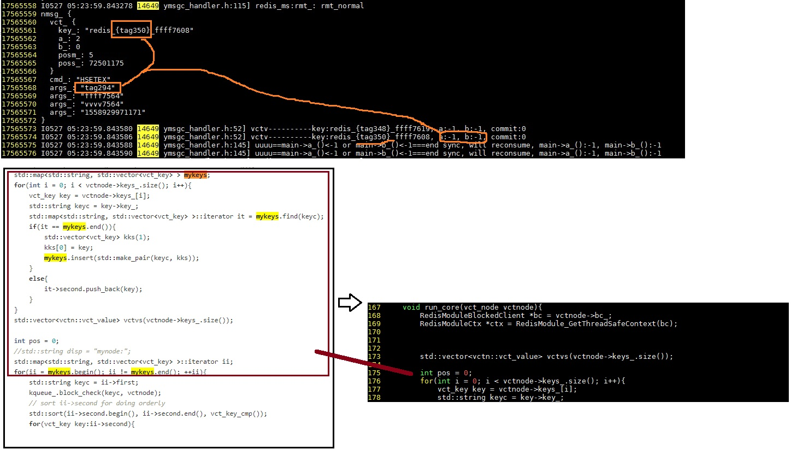
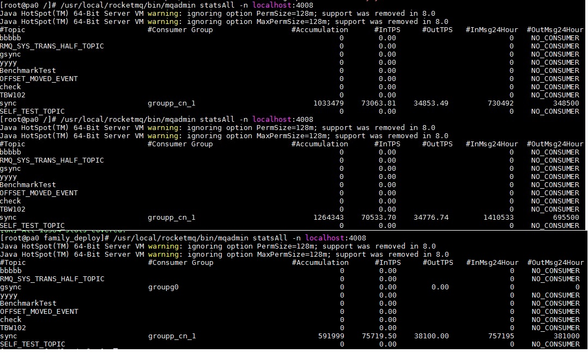
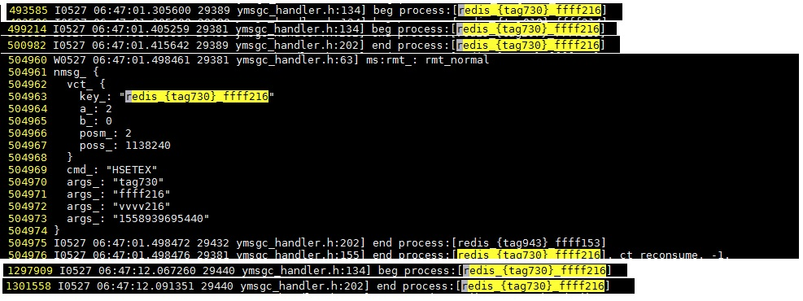
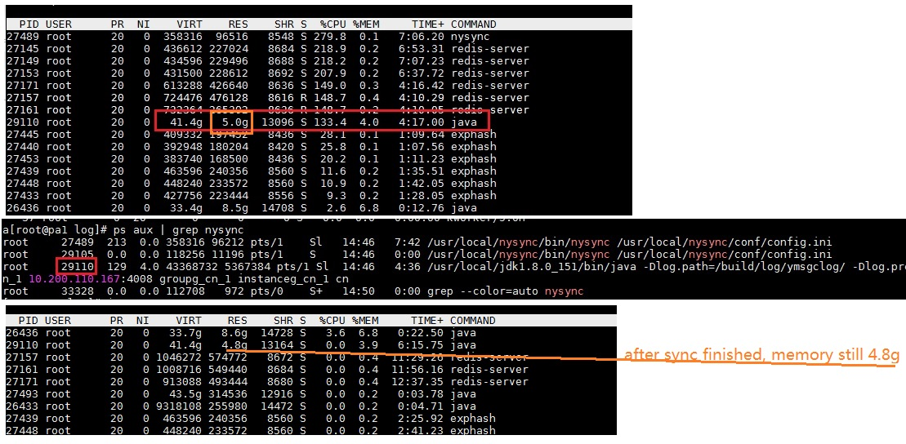
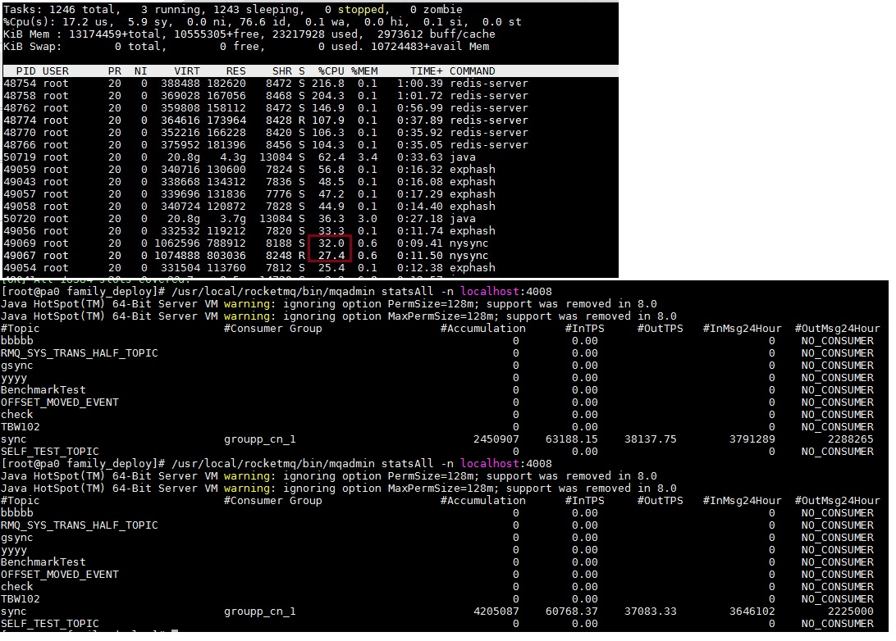
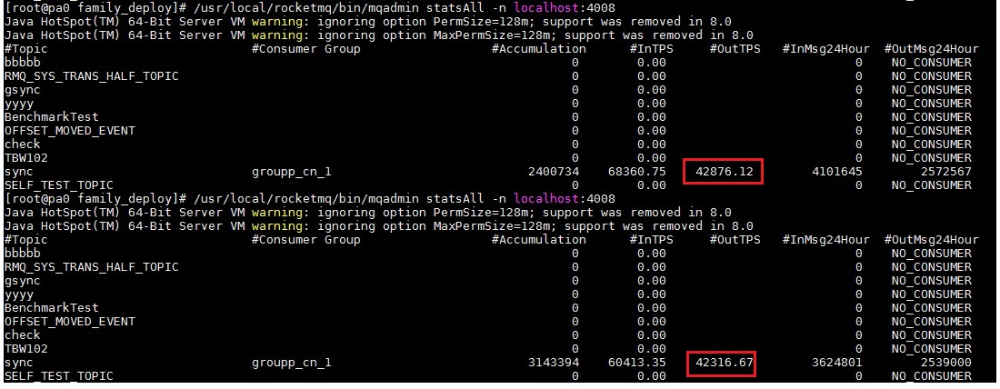
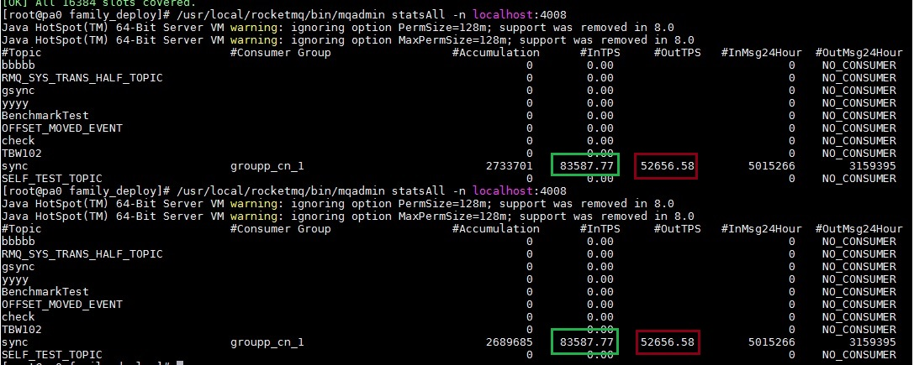
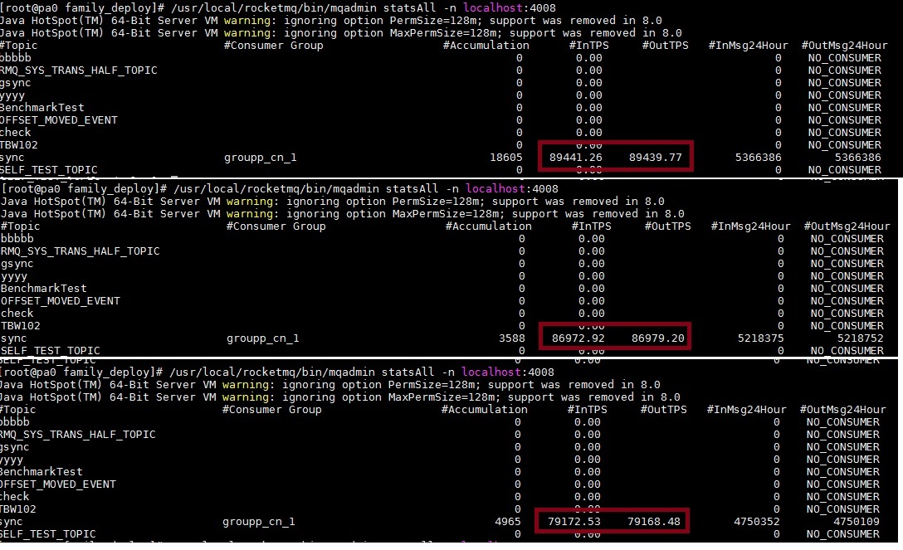
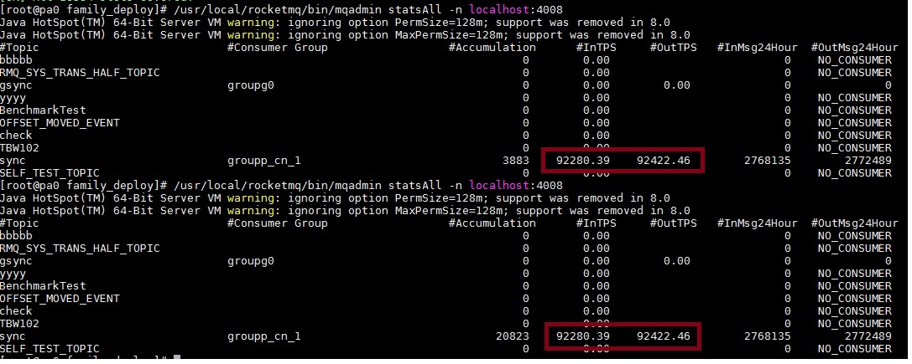
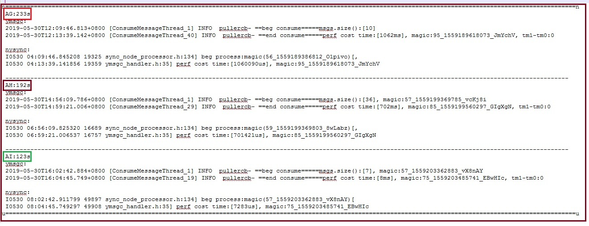

# 1.nysynca1

* batch sync ymsgcs

* TPS: 35-38k

* this time hit exphash vct bug: vct.key not the same as redis command key => nredis::vct::svct_mgr::run_core

[nysynca1](./imgs/perf3/nysynca1.pdf)

# 2.nysynca2

* perfctx for single redis command 

* decreaselog 

[nysynca2](./imgs/perf3/nysynca2.pdf)

# 3.nysynca3

* batch calling redis_cmd_node 

* should modify nredis::cluster.c: replace thisslot with thisn

[nysynca3](./imgs/perf3/nysynca3.pdf)

# 4.nysynca4

## 4.1
* extend nysync to 2 instances

* TPS: no perf

## 4.2 (no use [a.4.1])
* ymsgc local cache: change from 2000 t0 20000

* no log detail in ymsgc

* detail msg in nysync

* ~~increase nysync::workcount from 100 to 512 (no perf, I reset it to 100)~~

[nysynca42](./imgs/perf3/nysynca42.pdf)

# 5.nysynca5

* no log hsetex errormsg in nyysnc

* no detail msg in nysync

[nysynca5](./imgs/perf3/nysynca5.pdf)

# 6.nysynca6

* gcc with O3

* one thread on object(sync_node_processor),fixed constant(vector)

[nysynca6](./imgs/perf3/nysynca6.pdf)

# 7.nysynca7

* replace string[+=] with prepare alloced buffer

* fixed vector in sync_redis_caller

[nysynca7](./imgs/perf3/nysynca7.pdf)

# 8.nysynca8

* extend std::vector to nvector

[nysynca8](./imgs/perf3/nysynca8.pdf)

# 9.nysynca9

* element in nvector should not be new every time: vctkeys_

[nysynca9](./imgs/perf3/nysynca9.pdf)

# a.nysyncaa

* use nvector

* replace [string +=] with [format_ buffer]

* mq local cache increase from 20000 to 50000

[nysyncaa](./imgs/perf3/nysyncaa.pdf)

# b.nysyncab

* decrease redis_syncer::sync() new operator

* maybe error cause long time, set holdtime = 5min in [testing::perf::sync hsetex] 

* TPS: bad tps

[nysyncab](./imgs/perf3/nysyncab.pdf)

# c.nysyncac

* setConsumeTimeout from 1 to 10

* **log once beg_process&end_process**

[nysyncac](./imgs/perf3/nysyncac.pdf)

# d.nysyncad

* use move in redis_syncer::sync

* whole line use syncn

[nysyncad](./imgs/perf3/nysyncad.pdf)

# e.nysyncae

* 2 nysync instances

* CPU: not higher

* TPS: no higer

* BUT: profiler is good

* should check: reconsume&noreconsume situation => **[aofrewrite will cause some duplicate operators]**

* should fix: exphash hit error pos and exit in pa0(4005&4006)

[nysyncae1](./imgs/perf3/nysyncae1.pdf)

[nysyncae2](./imgs/perf3/nysyncae2.pdf)

# e.nysyncaf

* rerun 2 instances

* increase batch_msg_size from 500 to 1000 => tt

* decrease batch_msg_size from 1000 to 200 => uu TPS very low(<3w)

* batch_msg_size back to 500

* append magic parameter to ymsgc.thrift

* local cache to 10w

* safe sync_node new operator

[nysyncaf](./imgs/perf3/nysyncaf.pdf)

# g.nysyncag

* only get aoffile length once in syncupvct operator 

* TPS: > 40k

[nysyncag](./imgs/perf3/nysyncag.pdf)

[nysyncag\_redis](./imgs/perf3/nysyncag_redis.pdf)

# h.nysyncah

* batch write to rocksdb in synctime_mgr::set

* change all std::map to std::unorder_map in vct

* TPS: > 52k.    (send TPS up to 83k)

[nysyncah](./imgs/perf3/nysyncah.pdf)

[nysyncah\_redis](./imgs/perf3/nysyncah_redis.pdf)

# i.nysyncai

* **no realtime bind boost::function in vct operators**

* **value to reference, special at key_queue::add::myks**

[nysyncai](./imgs/perf3/nysyncai.pdf)

[nysyncai\_redis](./imgs/perf3/nysyncai_redis.pdf)

# nysyncasum

[c.log](./imgs/perf3/c.log)

[n.log](./imgs/perf3/n.log)

[c3.log](./imgs/perf3/c3.log)

